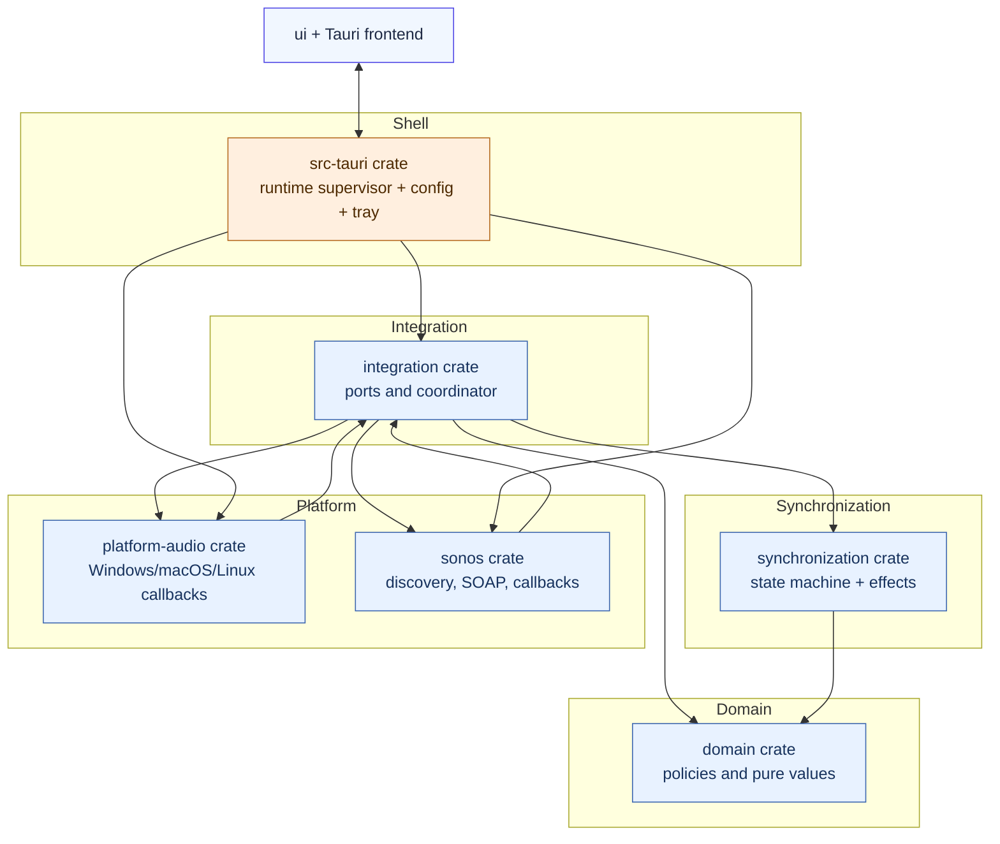
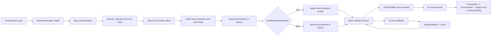
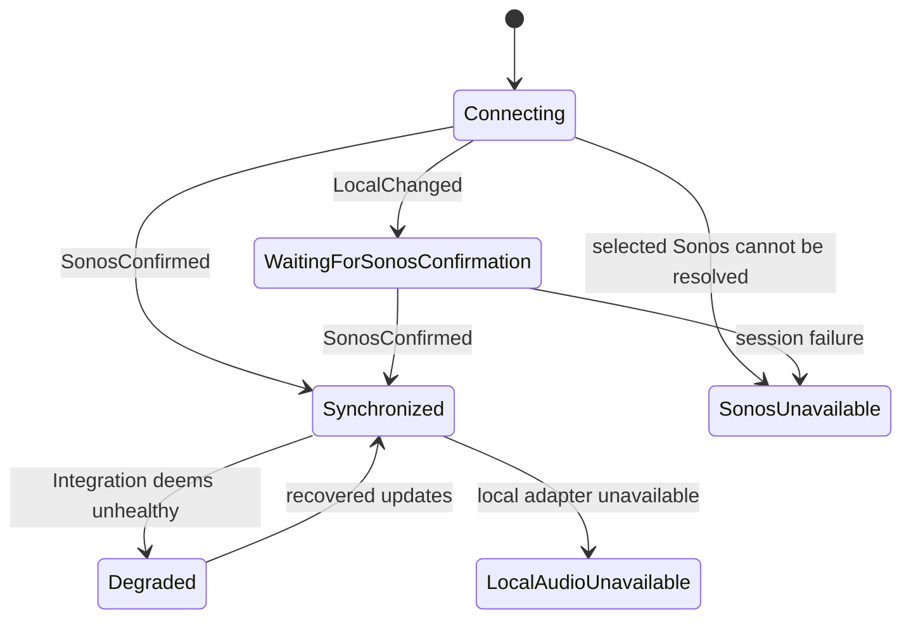

# Architecture

## System model

SpeakerVolumeBridge keeps one chosen Sonos player and one local output device in synchronization.

## Architectural layers

- `domain`: policy and data model only. No Tauri, OS APIs, or networking.
- `synchronization`: policy machine. It processes normalized local and Sonos events and emits desired side effects.
- `integration`: async coordinator and port abstractions.
  - coalesces local volume updates through bounded channels,
  - deduplicates repeated Sonos command writes,
  - applies optional mute mapping,
  - updates timing metrics.
- `sonos`: local-network client for SSDP, SOAP, GENA subscribe/renew/unsubscribe, and callback listener validation.
- `platform-audio`: OS adapters for local output change events and setting local volume or mute.
  Linux uses PulseAudio's `pactl` interface, which is also supplied by PipeWire on Ubuntu.
- `src-tauri`: composition root.
  - reads validated settings,
  - owns runtime lifecycle and tray status snapshots,
  - hosts command surface for frontend actions.

## Runtime lifecycle

## State and direction behavior

There are three related layers of state:

- Domain synchronization state (`domain::SyncState`): `Connecting`, `Synchronized`,
  `WaitingForSonosConfirmation`, `Degraded`.
- Integration health mode (`integration::Health`): `Healthy`,
  `SubscriptionDegraded`, `PollingFallback`.
- UI/runtime status: `Connecting`, `Synchronized`, `SonosUnavailable`,
  `LocalAudioUnavailable`, `UnsupportedLocalDevice`, and related states.

## Directional model

Synchronization direction is explicit:

- Two-way mode (default): Sonos confirmation maps back to local output.
- One-way mode: local output remains authoritative; local values are pushed to Sonos.

Both modes still enforce local intent deduplication and Sonos confirmation authority.

## Mapping and policy knobs

- `mapping`: `linear`, `cappedLinear`, or `piecewise`.
- `maximumSonosVolume`: global safety cap before write.
- `synchronizeMute` and `muteSpeakerAtZeroVolume`: mute behavior.
- `followDefaultAudioDevice` vs `fixedAudioDeviceId`: local endpoint selection.
- `fallbackPolling`: event loss handling strategy.

## Data safety boundaries

- No direct filesystem, network, or Sonos protocol action from the frontend.
- Protocol URLs and callback targets are validated before network calls.
- Diagnostics and frontend status are redacted and human friendly.
- Configuration writes are atomic with `.json.tmp` staging and schema validation.

The macOS login adapter treats absent Service Management entries as already
disabled, including `NotFound` after bundle replacement, and rechecks status
after failed removal. Registered or unknown states preserve removal errors and
the existing configuration. This remains shell-only behavior; see
[ADR 0006](decisions/0006-tauri-shell-and-safe-settings.md).

The protocol adapter uses Reqwest 0.13 and quick-xml 0.42. XML decoding is
performed by the streaming reader; protocol parsing retains explicit reference
unescaping and typed errors. See [ADR 0002](decisions/0002-local-sonos-client.md).

The settings form shares behavior across platforms while selecting separate
macOS, Windows, and Linux presentation styles in the frontend. See
[ADR 0012](decisions/0012-platform-settings-presentation.md).
macOS dropdown sizing runs after saved selections are restored during form mounting.

Windows uses a dedicated, scoped stylesheet and platform window configuration
for its resizable Windows 11 Settings presentation. OS-specific presentation
does not change the shared settings controls or synchronization lifecycle.

The shell preloads optional tray speaker controls asynchronously at startup and
refreshes them when connection state changes or the tray is clicked. Network
reads never block the menu event handler; menu updates run on the main thread.

Update checks share one shell orchestration path for startup, scheduled, wake and
manual triggers. The shell persists the last successful check and validated offer
across restarts, revalidates the cached offer's version, complete target identity,
and HTTPS action at startup, replaces cached offers only after a successful
catalog read, and deduplicates update notifications before delivery. Native update
notifications
carry activation intent; only activating one or choosing the tray Updates action
navigates to the Updates page.

At shell startup, a single installed-distribution resolver combines package-level
provenance with conservative platform evidence. It reports the workspace
application version and compiled application architecture. Debug/demo, missing,
conflicting, sideloaded or unverifiable packages never silently enroll in official
checks. Resolution failure is an update-only condition and cannot stop audio
synchronization. See [ADR 0019](decisions/0019-distribution-aware-updates.md).

The shell also owns one update service with injected catalog transport, clock,
distribution metadata and persistence. It starts only after synchronization has
started, waits 30 seconds, and performs at most one shared request at a time.
Successful checks impose a 24-hour freshness interval; transient failures use
bounded backoff. Wake and clock changes cannot bypass the attempt guard. Catalog
requests never use the Sonos adapter and contain no speaker/configuration data or
persistent installation identifier.

Settings refreshes are asynchronous and guarded against edits and pending writes.
Speech Enhancement chooses the same model-appropriate EQ for reads and writes;
see [ADR 0009](decisions/0009-sonos-speaker-controls.md).

The Sonos adapter derives per-control availability from validated read responses,
model-specific EQ selection and advertised services. The shell forwards this
alongside current values. Unsupported and temporarily unavailable remain distinct;
event omissions never remove capabilities. No networking enters the domain or
synchronization crates.

Runtime volume/mute/status changes are pushed to Settings immediately; the one-second
cached snapshot poll remains a UI-delivery backup. Volume-only and mute-only GENA
notifications trigger authoritative reads rather than being rejected. With fallback
polling enabled, fixed-deadline speaker health reads run every five seconds when
subscribed and every second when unsubscribed, updating both synchronization and
visible diagnostics. Optional settings also receive periodic backup refreshes,
including controls that do not publish RenderingControl events.

Slider gestures preview locally and commit on release (keyboard: key release).
Active gestures block background form replacement and control refresh. Settings
writes from explicit user actions are serialized; device reads only update display
properties, never dispatch input/change events or enqueue writes. Existing audio
origin/expected-write suppression remains in the synchronization adapters. Sonos
notifications do not identify the originating controller, so an echoed value is
not treated as proof of authorship and genuine external changes remain observable.

Catalog publication retains the validated document and updates only `generatedAt`
and `entries`, preserving additive catalog fields and unchanged entry/action
metadata. The complete result is validated again before writing; repeated
publication returns the original content. See [ADR 0019](decisions/0019-distribution-aware-updates.md).

## Global Night Mode scheduling

A separate shell worker applies one global weekly half-hour schedule exclusively
to the selected compatible speaker. Pure calendar calculation lives in `domain`;
read/confirm/enforce policy lives in the integration Night Mode controller. It does
not enter the volume synchronization state machine. Native wake and notification
adapters stay in the shell. A shared configuration/Night Mode write gate prevents
selection races, while volume synchronization continues independently. See
[ADR 0013](decisions/0013-global-night-mode-schedule.md).

The default-off night schedule Loudness policy uses a separate integration port over
the same shell-owned Sonos adapter. On entry it records speaker-scoped restoration
ownership before disabling Loudness. While active it enforces Loudness off without
coupling failures to Night Mode scheduling. On exit, schedule disablement, or policy
disablement it restores Loudness only when the bridge previously changed it. The
persisted ownership marker survives restart and is never applied to another speaker.

Tray speaker controls retain their native menu objects for the tray lifetime.
Refreshes update values in place; capability changes only attach or detach cached
objects, preserving action targets while the OS is dispatching menu clicks.

Desktop clock formatting is read by the shell adapter: Foundation on macOS,
GetLocaleInfoEx on Windows, and GNOME clock-format/LC_TIME on Linux. The frontend
applies that preference to both axis labels and interval tooltips. The shared
rectangular editor and scheduler are used on all three platforms.

Windows schedule tooltips use an opaque platform surface in both color schemes;
the shared hover interaction remains in the frontend (ADR 0013).

Windows Night schedule presents current state, next change, notification guidance,
and action errors together in its dedicated Status card. The shared notice output
moves into this card while the schedule page is active (ADR 0012).
The Status label sits left of the right-aligned, wrapping text. The Windows default
height is 820 logical pixels to allow multiline status. Successful settings actions
clear prior errors without adding confirmation messages on any platform.
The Windows shell registers an unpackaged notification identity before checking
permission and uses that same identity for native toast delivery. Unpackaged startup
registers the sender's COM activator and quoted executable launch command as well
as its display name. A process-lifetime MTA owns the class factory; notification
activation opens Settings on the UI thread. Demo and normal activators are separate.
The Start menu shortcut stores both the same sender ID and toast activator CLSID;
local startup creates it when absent and repairs its properties without retargeting
an existing installed shortcut. Recent native toast objects are retained in a bounded
queue so asynchronous delivery failures can be logged.
First-use sender
registration submits a suppressed, expiring toast and removes it before querying
permission again. Packaged apps use their package identity (ADR 0013).

## Hardware-free UI demo

Demo startup assigns a distinct runtime package name as well as application
identifier. Windows/Linux login registration uses the package name, preserving
the normal application's autostart entry when demo login settings change.

The default-off `ui-demo` debug feature runs the normal shell and native commands
against a loopback Sonos simulator. Discovery and resolution select only this
simulated device; SOAP and GENA use the production client. The scheduler, tray,
local audio and synchronization services remain active. Demo configuration and
logs use a separate app identity. Browser previews alone use the frontend mock.
See [ADR 0014](decisions/0014-ui-demo-build.md).

Night schedule notifications share the shell's speaker display-name normalization
with device selection; notification bodies never need the renderer suffix to
identify a speaker. This applies to both scheduled boundaries and entry/exit caused by applying schedule edits.
Saving compares the previous and new enabled schedules at the same timestamp.
Only a membership change produces notification intent after speaker confirmation;
remaining inside/outside and disabled schedules stay silent.
Enabling a previously disabled schedule during a selected period applies Night Mode
immediately and sends a start notification after speaker confirmation when On start or
On start and end is selected. Enabling outside selected periods, enabling an already
enabled schedule, and disabling scheduling do not notify. Disabling leaves the speaker
state unchanged. The worker subsequently reconciles silently to avoid duplicate
notifications.

Linux delivery uses one persistent asynchronous D-Bus connection with a bounded
timeout. GNOME removes an app's notifications when their sender disappears, so
the shell retains that connection after delivery. The blocking plugin path is
incompatible with the shell's Tokio runtime and is bypassed (ADR 0013).

Linux settings use a shared Ubuntu/Yaru-inspired presentation on x86-64 and
ARM64, with a 1080-pixel fixed-width native window, an 800-pixel default height and
responsive grouped controls. Vertical resizing remains available.
The platform stylesheet stays inside the frontend; the shell selects Linux
window bounds through `tauri.linux.conf.json`. See ADR 0012.
Linux Night schedule status, notification permission guidance, and schedule error
feedback share the dedicated Status row below notifications (ADR 0013).
The shell requires Tauri 2.12 with Tao's repaired Wayland decorations so native
title-bar buttons receive clicks on first show and after reopening (ADR 0012).

The Linux tray adapter uses a white icon for Ubuntu's dark top bar independently
of the application color scheme, retaining the disconnected badge (ADR 0012).

The macOS release packages its signed and notarized app into a separately signed
and notarized DMG as its only direct-download format for drag-to-Applications
installation; see [ADR 0015](decisions/0015-macos-dmg-download.md).

Settings reset cancels debounced autosaves, invalidates older save responses and
joins the same user-write queue as configuration saves. A reset therefore runs
after writes already in flight; stale saves cannot restore pre-reset settings.

Unpackaged Windows notification registration also materializes the bundled app
icon in the app's local data directory and registers its absolute path as the
sender `IconUri`. The icon remains available after build-directory cleanup or
application exit. Paths are canonicalized to their physical location before
registration so an app launched from a packaged development host does not give
Explorer a redirected path it cannot resolve. Start menu shortcuts use an explicit
bundled ICO asset. MSIX notifications continue to use the package manifest assets.
The registered Windows installation owns the normal Start menu target. Startup
repairs older development targets while development runs retain a valid installed
target. Full NSIS uninstall removes the per-user notification sender and COM
activation registration; in-place updates preserve them (ADR 0013).

## Release artifact flow

macOS direct-download configurations share distribution provenance resources.
The configuration without a provisioning profile uses checked-in base
entitlements; the profile variant uses generated profile-specific entitlements
and embeds the profile (ADR 0015).

Release jobs verify the prepared commit belongs to trusted `develop` history,
then detach at that exact commit before executing release code. Moving the branch
forward does not change or invalidate the selected release. Native
Windows x64/ARM64 MSIX outputs are combined and verified in an unprivileged job
before the all-platform build gate. Signing follows that gate; publication also
requires successful Mac App Store packaging when requested. Store submission
reuses the verified upload. Direct downloads use one permanent filename per
package, with version identity supplied by the release tag (ADR 0015). See
[release documentation](release.md) for the variants and validation gates.

Microsoft Store retries resolve an existing release tag to the original verified
upload, then independently validate its version and both embedded architectures.
Validation runs without Store credentials. Submission reuses that artifact and
requires a protected environment; it never rebuilds or increments the version.
Normal release and manual retry call the same reusable Store publishing workflow
with a published GA tag. It validates the tag and bundle before protected submission;
standalone packaging remains separate. Both paths share the pinned CLI publishing
script and submission concurrency group. Publishing selects the upload file directly
and verifies Store-reported package versions and architectures after commit. See [release recovery](release.md#retry-or-debug-an-existing-microsoft-store-release).

Store submission metadata may represent the combined upload as one Neutral
package. Accept that representation only when its uploaded filename and version
match the retained artifact and local verification confirms both embedded x64
and ARM64 packages. Neutral alone does not prove architecture coverage. This
submission check does not establish certification or public availability.

Audio echo suppression retains repeated and overlapping expected local states for
500 ms without pausing listening. Unchanged local properties are not rewritten.
See [ADR 0017](decisions/0017-volume-feedback-suppression.md) for platform behavior,
regression coverage, and the limitations of value-based origin detection.

## Upgrading from the former app

Users quit and remove the former app before using the renamed app. The shell
starts synchronization directly and does not inspect other processes, gate writes
on a legacy-app check, or display a conflict warning. Settings and Night Mode keep
their normal selection/write serialization and explicit stop behavior. See
[decision 0018](decisions/0018-rebrand-and-legacy-protection.md) and the
[manual removal guide](removing-old-app.md).

Windows installer directory migration stays in the NSIS adapter: only the former default folder is relocated; custom directories, data identity and Store identity remain stable. See ADR 0018.

The update service also owns the persisted Stable/Prereleases policy and explicit
package capability. Policy changes increment a generation before clearing offers;
responses, notification claims and queued page actions revalidate that generation.
Stable clients retain schema v1; opted-in clients select the newest compatible GA,
Alpha or Beta from schema v2. Installed publisher classification is separate from
user preference. Later installers must consume this same contract. See ADR 0019.

## Release catalog delivery

Release completion and recovery share package inspection and atomic pair
preparation outside the runtime crates. GA advances both develop-owned feeds;
Alpha/Beta advance only v2. Store entries, additive metadata and persistent
withdrawal ledgers survive reconciliation. Focused PRs retain required review
and CI; release-published, catalog-pending and catalog-live are separate states.

One serialized Pages composer restores an immutable last-published GA website
for catalog delivery or builds approved main GA content, then overlays current
develop feeds. Non-catalog bytes are preserved and actual served bytes/cache
refresh are verified. Durable Git snapshots replace reliance on expiring Actions
artifacts; missing state fails closed. See [ADR 0020](decisions/0020-independent-catalog-delivery.md)
and [operator instructions](catalog-operations.md) for bootstrap and prerequisites.

Catalog automation first checks App credential availability on a lightweight
runner. Missing credentials produce an explicit catalog-pending outcome while
preserving successful application publication; proposal execution requires both
credentials. Token and PR failures remain actionable automation errors (ADR 0020).

The update manager injects its timer for lifecycle regression coverage while
production retains the same 30-second delay and retry sequence. Tests enter the
shared startup ownership path and verify duplicate-start prevention and shutdown
cancellation, including a pending catalog transport. See the phase-one operational
readiness audit in the verification matrix.
