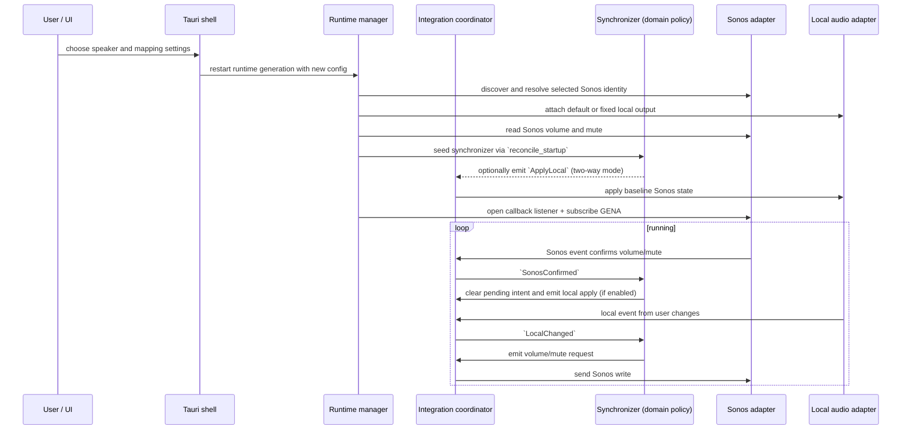

# How SpeakerVolumeBridge works

SpeakerVolumeBridge keeps one speaker and one local audio endpoint synchronized.

## End-to-end flow

## Startup and discovery

Configuration is loaded from JSON on startup and validated before it is used.
Speaker discovery uses SSDP in the local subnet and uses the cached description URL
first if it still matches the selected UDN.

At runtime startup, the selected endpoint is attached and the synchronizer is seeded
with the latest Sonos read.

Update discovery separately resolves the installed distribution at application
startup. Direct packages, Store packages and Debian packages carry different
package metadata even when they reuse the same executable. OS evidence must agree:
a Store-signed Windows package, App Store receipt, or official Debian package
registration is required for those editions. Ambiguous/custom packages remain
unknown and do not affect speaker startup.

New builds of recognized direct and Debian installations query the anonymous GitHub Releases
API 30 seconds after startup by default and no more than once per 24 hours after a
successful check. Stable only excludes prereleases; Include prereleases considers
both stable releases and prereleases. Offers require a compatible published asset
and open the exact validated release page. Responses and pagination are bounded,
and rate-limit responses postpone further requests. Manual checks bypass freshness
but join an in-flight request. The persisted
record contains only the preference, last attempt/success times, and last-notified
edition/version. Background failures remain quiet and never change audio behavior;
manual failures are visible and retryable. Debug, demo, custom and ambiguous
packages do not check automatically.

The Updates page shows the installed version and distribution, last successful
check and every checker state. An available offer remains discoverable after
Later or notification denial. The persisted Update notifications switch suppresses
native update notices independently from automatic checks; enabling it is the
only update flow that may request OS permission. Open update page is enabled only for the exact
validated offer; the shell rechecks version and URL immediately before invoking
the operating system's default HTTPS handler. No browser opens at startup and no
package is downloaded or installed.

## Synchronization strategy

Two modes are supported:

- Two-way mode: confirmed Sonos values are applied back to local output.
- One-way mode: local output remains the reference while Sonos follows local volume.

In both modes local volume changes are converted through the configured mapping and
issued as pending Sonos intents. A newer local intent replaces older pending
intents. Mute requests are always sent immediately.

## Eventing and fallback

The runtime uses GENA callbacks for prompt updates. Callback subscription is
validated against peer identity and active SID. If renewal or delivery becomes
unstable, the integration enters polling fallback and uses periodic reads until
callbacks are healthy again.

Renewal is scheduled at 80 percent of the subscription timeout. Backoff is used
for reconnection when session startup fails.

## Write suppression

Both Sonos and local adapters mark callback origin:

- Windows: callback context IDs.
- macOS: expected-write tracking with tolerance and expiry.
- Ubuntu: PulseAudio/PipeWire `pactl subscribe` events with expected-write tracking.

Suppressed local callbacks are ignored by the synchronizer so confirmed Sonos values
do not create write loops.

## Configuration inputs that affect behavior

- `twoWaySynchronization`: controls direction mode.
- `synchronizeMute`: includes mute as part of local intent application.
- `muteSpeakerAtZeroVolume`: forces muted state at local zero volume.
- `mapping`: `linear`, `cappedLinear`, or `piecewise`.
- `maximumSonosVolume`: global cap on Sonos target.
- `followDefaultAudioDevice` vs `fixedAudioDeviceId`: output selection strategy.
- `fallbackPolling`: enables fallback polling when callback-driven state is not
  healthy.

Settings can be saved on first launch with Start at login disabled. The login
service is contacted only when that option changes, so login-service errors do
not block unrelated settings updates.
On macOS, disabling an already-absent login item also saves successfully. If
macOS refuses to remove an entry that remains registered, Settings explains how
to remove it through System Settings and keeps the previous saved preference.

Speaker sound controls update from local Sonos RenderingControl push notifications.
Settings-only events no longer require accompanying volume/mute fields. The app
reads the speaker after a notification and updates Settings and the tray. Focus
and page changes also refresh device data. Devices/settings without event support
remain dependent on these refreshes; subscription failures use a polling fallback.

Speaker controls show “Not supported by this speaker” only for an absent required
service or an explicit unsupported-action response. Failed or ambiguous reads show
“Temporarily unavailable” and are retried on refresh; they are not treated as off.
An off switch or zero tone value can still be fully supported. Detection performs
no setting writes.

Runtime volume/mute/status changes are pushed to Settings immediately; the one-second
cached snapshot poll remains a UI-delivery backup. Volume-only and mute-only GENA
notifications trigger authoritative reads rather than being rejected. With fallback
polling enabled, fixed-deadline speaker health reads run every five seconds when
subscribed and every second when unsubscribed, updating both synchronization and
visible diagnostics. Optional settings also receive periodic backup refreshes,
including controls that do not publish RenderingControl events.

Slider gestures preview locally and commit on release (keyboard: key release).
Active gestures block background form replacement and control refresh. Settings
writes from explicit user actions are serialized; device reads only update display
properties, never dispatch input/change events or enqueue writes. Existing audio
origin/expected-write suppression remains in the synchronization adapters. Sonos
notifications do not identify the originating controller, so an echoed value is
not treated as proof of authorship and genuine external changes remain observable.

## Night Mode schedule

Open **Night schedule** to edit one global schedule for the speaker selected on
Devices. The schedule only acts on compatible speakers. Switching speakers applies
the same schedule to the new selection without changing the previous speaker.
An unavailable or unsupported selection pauses scheduling and preserves the grid.

The gray editor shows Monday–Sunday rows and 48 half-hour columns across the full
day. Labels appear every three hours, through 21:00/9 PM, without repeating
midnight at the end. Hover tooltips appear after 100 ms. Click or press Space to
toggle a cell; arrow keys move between cells. Dragging creates a rectangle: starting
on an empty cell selects the whole rectangle; starting on a selected cell clears
it. Overlapping cells all take that same state. Dragging back shrinks the rectangle
and restores cells outside it to their state before the gesture.

**Save schedule** stores the grid and immediately applies its current block: on
inside a selected block, off outside. This one-shot action works even when recurring
scheduling is disabled and can be repeated without editing the grid. **Cancel**
restores the saved grid; **Clear all** edits the draft until saved. Background reads
and speaker selection changes preserve unsaved drafts.

**Enable schedule** saves immediately. During selected periods, the scheduler keeps
Night Mode on and rejects manual off. Disable scheduling first to use manual off;
disabling alone leaves Night Mode unchanged. Outside selected periods, manual
changes are allowed. Leaving a scheduled period turns Night Mode off once.
The tray has a checked **Night schedule** item directly above **Night sound**.
The checkmark represents enabled scheduling; the editor opens through Settings.

**Disable loudness during night schedule** is off by default and saves immediately.
When enabled, Loudness is kept off while the current time is inside the enabled
schedule. If the bridge turned Loudness off, it restores Loudness after the period,
when scheduling is disabled, or when this option is disabled. Loudness that was
already off remains off. Restart-safe restoration state belongs to the selected
speaker; it is never transferred to another speaker. A Loudness capability or
network failure is retried independently and never stops Night Mode scheduling.
Manual Loudness enable actions are unavailable while this policy is active.

**Night schedule notifications** saves immediately and offers **On start**,
**On end**, **On start and end**, and **Never** (the default). Confirmed boundaries notify
only when their direction is selected. Applying an edited schedule also notifies
only if it makes the current time enter or leave the enabled schedule, using the
matching direction after the speaker state is confirmed. Saving while remaining
inside or outside the schedule sends no notification. Disabled scheduling is silent. Adjacent selected cells do not notify. Startup,
wake, recovery, selection changes, manual changes, and enforcement corrections
remain silent. Permission denial and OS notification suppression never stop
scheduling or volume synchronization.

Enabling a previously disabled schedule during a selected period applies Night Mode
immediately and sends a start notification after speaker confirmation when On start or
On start and end is selected. Enabling outside selected periods, enabling an already
enabled schedule, and disabling scheduling do not notify. Disabling leaves the speaker
state unchanged. The worker subsequently reconciles silently to avoid duplicate
notifications.

Scheduling follows the machine's time zone. Startup, wake, reconnection, selection
changes, clock changes, and schedule enabling reconcile only the current expected
state; missed transitions are never replayed. Scheduling runs independently of
local audio availability and volume fallback polling.

Clock labels follow Foundation preferences on macOS, the regional time format on
Windows, and GNOME clock-format or LC_TIME on Linux. Preferences are reread when
Settings regains focus. Other Linux desktop-specific clock overrides may require
matching LC_TIME. The form omits repetitive disabled/outside-period status text;
errors, capability guidance, and active-period restrictions remain visible.
On Linux, a dedicated Schedule status row below notifications shows the current
state, including disabled and outside-period states. Schedule errors appear in
that same row instead of beneath the editor. Successful saves show no confirmation.

On Windows, the dedicated Night schedule Status card is the single Status area. It shows
disabled/outside-period state as well as active restrictions, the next change,
notification guidance and action errors. Its label sits on the left and its text
wraps on the right. Successful saves and other settings actions show no confirmation
message; a successful retry clears the prior error. Other platform layouts are unchanged.
Windows local runs register the app as a notification sender, so notifications
use Speaker Volume Bridge rather than relying on PowerShell. Existing Windows
notification preferences and Do not disturb still apply.

## Update checks and notifications

Startup, periodic, wake and manual checks share orchestration, persist preferences
and reserve each notification once before sending. Startup waits 30 seconds;
successful results remain fresh for 24 hours. Bounded retries retain the last valid
offer on failures. Shutdown cancels the worker and pending requests.

Stable only excludes GitHub prereleases. Include prereleases considers both stable
and preview releases. Both use the anonymous public release list, compare semantic
versions and require a compatible official package asset. No Store availability is
inferred. Changing policy saves it, invalidates prior links immediately and checks
even with automatic checks disabled. Obsolete responses cannot restore old offers.
Returning to Stable only waits for a strictly newer GA version without downgrading.

Notifications leave the current Settings page unchanged. Activating an update
notification or choosing the tray check action opens Updates. Open update page
revalidates and opens the exact project release page; it never installs a package.
Previous-source cache freshness is discarded during source migration. Unavailable
or rate-limited responses are never described as up to date. See ADR 0021.

## UI demo builds

Explicit `ui-demo` debug builds open Settings with a simulated Sonos speaker and
a demo label. The normal scheduler, tray, settings, notifications and local audio
operate unchanged, including manual-off locking during active scheduled periods.
Demo app settings persist separately from normal settings; speaker state resets
on restart and is reconciled by the runtime. No real Sonos device is contacted.
Local output volume and mute can change through normal synchronization. See
[development](development.md#hardware-free-ui-demo) for build commands and styling.

Audio echo suppression retains repeated and overlapping expected local states for
500 ms without pausing listening. Unchanged local properties are not rewritten.
See [ADR 0017](decisions/0017-volume-feedback-suppression.md) for platform behavior,
regression coverage, and the limitations of value-based origin detection.

## Upgrading from the former app

Users quit and remove the former app before using the renamed app. The shell
starts synchronization directly and does not inspect other processes, gate writes
on a legacy-app check, or display a conflict warning. Settings and Night Mode keep
their normal selection/write serialization and explicit stop behavior. See
[decision 0018](decisions/0018-rebrand-and-legacy-protection.md) and the
[manual removal guide](removing-old-app.md).

Store editions have a separate `store_managed` update state. The shell rejects
GitHub discovery for these editions at the shared service boundary, disables
automatic checks even for migrated enabled preferences, and exposes only fixed
native Store destinations through an edition-authorized command. No release
offer or Store availability claim is created. Direct release-policy behavior is
unchanged. Existing catalog clients require a one-time manual upgrade; see
[upgrade guidance](rebrand-upgrade.md).

Direct macOS updater preparation is a packaging-only boundary. Verified payloads
remain validation artifacts retained in CI and never create installation actions. The
GitHub release-page fallback, version/policy guards and Store delegation remain
unchanged. Native sandboxed replacement acceptance is pending; see
[ADR 0023](decisions/0023-macos-updater-artifacts.md).
